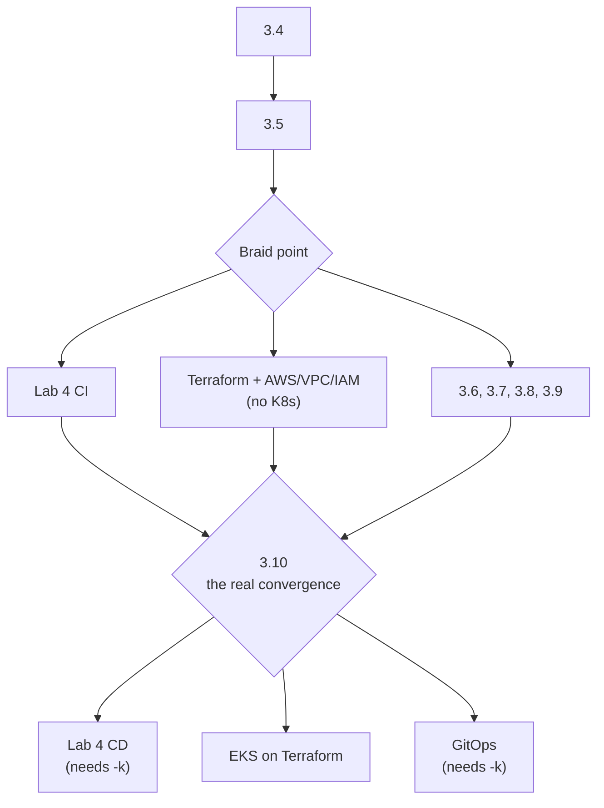

# Lab Sequencing Recommendation — K8s, CI/CD, and AWS/Terraform

My honest recommendation: **Kubernetes with KinD next, then GitHub Actions, then AWS + Terraform** — in that order. Here's the reasoning, not just the verdict.

## Why K8s First

Every "long-term direction" note in the Lab 02 doc was pointing here on purpose — network segmentation → NetworkPolicies, healthchecks → liveness/readiness probes, resource limits → requests/limits, the `pgdata` volume → PersistentVolumeClaims, `.env`/Docker secrets → ConfigMaps/Secrets. You didn't just build an app in containers, you built it with the exact vocabulary K8s uses, on purpose. Doing K8s next cashes that in while it's fresh, instead of letting it go stale under a detour through AWS/Terraform first.

There's also a genuinely satisfying payoff waiting for you there, tied directly to something you decided not to fully build in this lab: the round-robin scaling problem. You correctly identified that `--scale` + a static nginx upstream block is fiddly, needs a resolver hack, and doesn't discover new replicas automatically. In Kubernetes, a Service in front of a Deployment with `replicas: 3` load-balances across pods correctly, out of the box, with none of that friction — because kube-proxy handles exactly the problem you ran into. That's not a coincidence; it's the actual reason Kubernetes exists. Seeing that click into place is a much better lesson landing right after Lab 02 than it would be landing after a detour through AWS.

KinD also keeps the blast radius small: it runs on the same Ubuntu VM, costs nothing, and lets you break things and rebuild in seconds. That matters more than it sounds like — you want your first real K8s mistakes (misconfigured probes, wrong selector labels, a Service pointing at nothing) to be free and instant, not billed by the hour on EKS.

## Why GitHub Actions Second, Not First

Right now every image build in this lab has been a manual `docker build` you typed yourself, and you've never pushed an image anywhere — everything's lived only in this host's local image store. CI/CD's natural job is: lint → build → scan (you already know Trivy) → push to a registry → deploy. That last step — deploy — doesn't have anywhere meaningful to go yet. Once KinD exists, "on push to main, build, scan, push to GHCR, then `kubectl apply` to the cluster" becomes a real, complete pipeline instead of one that stops at "push to a registry and shrug." Sequencing it after K8s means every step in the pipeline has an actual destination.

## Why AWS + Terraform Last

Two honest reasons.

First, cost and blast radius — Terraform mistakes and AWS misconfigurations cost real money and take longer to recover from than a local KinD cluster you can delete and recreate in ten seconds. It's worth having your fundamentals solid somewhere free before paying to learn the same lessons again in the cloud.

Second, there's a fork worth deciding on deliberately rather than by default: does "AWS" mean lifting this Compose stack onto a plain EC2 instance (a smaller, complementary step — VPCs, security groups, remote Terraform state, IAM basics, but no K8s involved), or does it mean EKS (which assumes you already know the K8s objects you'd be learning in the KinD lab)? If you already know K8s from KinD, EKS becomes "the same manifests, on infrastructure Terraform provisioned" — a clean capstone. If you go AWS first, you'd be learning cloud networking, Terraform, and K8s all at once, which is a lot to debug simultaneously when something inevitably breaks.

## Recommended Sequence

1. **Lab 03 — Kubernetes via KinD.** Translate `docker-compose.yml` into Deployments/Services/ConfigMaps/Secrets/PVCs 1:1, add an Ingress controller as the direct successor to `edge-proxy`, and specifically revisit the round-robin scaling story with a real Deployment + Service.
2. **Lab 04 — CI/CD with GitHub Actions.** Lint (hadolint) → build → scan (Trivy) → push to GHCR → `kubectl apply` against the KinD cluster (or a self-hosted runner reaching it). This is also where a registry enters your world for the first time.
3. **Lab 05 — AWS + Terraform.** Provision EKS (or start with plain EC2 if you want a gentler on-ramp first), point Lab 04's pipeline at it instead of KinD, and introduce remote Terraform state + IAM roles for GitHub Actions via OIDC — genuinely how this is done in real production pipelines, and a strong finishing topic.

## Do These Two First, Then Braid

**3.4 (triage), then 3.5 (rollouts + graceful shutdown).** Both before you open another lab, and here's the specific reasoning rather than "finish what you started":

**3.4 is the skill that makes a break safe.** If you step away for three weeks and come back to a cluster that's misbehaving, or your first EKS cluster does something strange, the triage procedure is what makes that recoverable instead of demoralising. It's also the shortest remaining sub-lab and its deliverable is a written table, which is the most break-proof artifact in the whole series.

**3.5 is the one that changes how you'll write Lab 4.** A CD pipeline built without knowing about `preStop`, SIGTERM, and `terminationGracePeriodSeconds` produces exactly the pipeline that drops requests on every deploy — and you won't know, because the rollout reports success. Learning that after you've written the pipeline means rewriting it. Roughly 10 hours for both.

## What You Can Start Today With No More Kubernetes

This is the part that surprised me when I mapped it out.

**Lab 4's entire CI half.** Workflow syntax, triggers, jobs and steps, matrix builds, caching, secrets, OIDC to AWS, building all five images, running tests, trivy/docker scout scanning, pushing to GHCR. That needs Lab 02 only — you already have everything. CI and CD are genuinely separable, and only the CD half touches Kubernetes.

**Lab 5's entire Terraform half.** HCL, providers, state (local, then S3 with locking), variables and outputs, modules, plan/apply/destroy, drift detection, import. Plus the AWS fundamentals underneath: IAM, VPC, subnets, route tables, security groups, EC2. Zero Kubernetes. And the hard part of Terraform is the state model and the module discipline, neither of which has anything to do with what you deploy onto.

That's realistically two to three weeks of material available right now.

## Where They Converge

`-k` is the Kustomize flag for `kubectl`. It's shorthand for "this directory contains a `kustomization.yaml` — render it, then apply the result."

```bash
kubectl apply -f manifests/       # apply these files as-is
kubectl apply -k overlays/kind    # render this kustomization, then apply
```

**3.10 is the milestone that matters, not any of the ones before it.** Kustomize overlays are the literal handoff artifact — Lab 4's CD job is `kubectl apply -k overlays/prod` with an image tag override, and GitOps is a controller doing the same thing. Without it, both labs involve hand-editing YAML, which teaches the wrong habit.



Also worth knowing: **EKS on Terraform only needs 3.1 and 3.3 to be worth doing.** Standing up a cluster and getting your app reachable through an ALB is entirely achievable now. 3.8 (RBAC → IRSA), 3.9 (storage → EBS CSI), and 3.10 make it *good* rather than *possible*. So if Terraform is what you're itching to do, you're not blocked.

**Monitoring is the most flexible** — it needs a cluster with real workloads, which you have. Slightly better after 3.6, since metrics-server and right-sized requests give you something meaningful to look at.

## Two Practical Notes

**Two active labs, not four.** Braiding works because context-switching between two related things reinforces both. Four active threads is thrash, and the tell is when you spend the first twenty minutes of every session re-reading where you left off.

**Pausing the cluster is cheap.** You don't have to leave it burning RAM:

```bash
docker stop lab3-control-plane lab3-worker lab3-worker2   # reclaim ~1.5 GB
docker start lab3-control-plane lab3-worker lab3-worker2  # comes back as it was
```

Everything survives — etcd, your PVC, the Traefik release, the Gateway API CRDs. Give it 60–90 seconds and check `kubectl get nodes`. Worth testing once now so you trust it later.

**Concretely:** 3.4, then 3.5, then open Terraform. Terraform over GitHub Actions first, because it's the bigger unfamiliar thing and it's the one with the longest zero-dependency runway.
